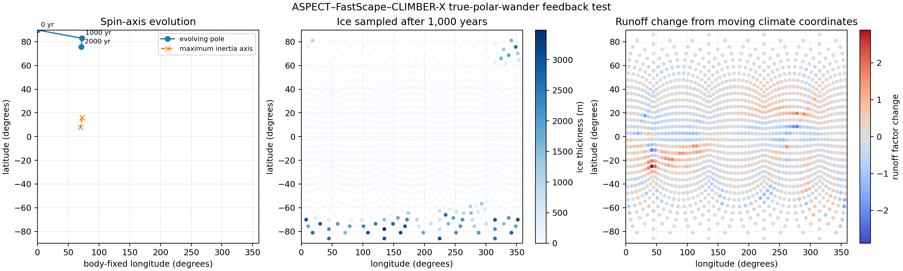

# FastScape climate feedback with true polar wander

This example adds an evolving spin axis to the global FastScape C++ coupling.
ASPECT directly integrates its three-dimensional moment-of-inertia tensor. The
plugin subtracts the initial tensor, adds the prescribed ice-sheet load and a
stabilizing rotational bulge, and finds the maximum principal inertia axis.
The spin axis approaches that direction over the chosen relaxation time.

ASPECT and FastScape coordinates remain fixed to the solid Earth. Before each
landscape step, the plugin converts every surface location into longitude and
colatitude around the evolving spin axis and resamples erosion strength,
runoff, ice thickness, and basal ice velocity. Consequently climate zones move
over the surface, while erosion, deposition, topography, and mantle density
change the tensor used at the next step.

The example's small bulge and short relaxation time are chosen only to produce
a visible result in a short test. The companion local test
`fastscape_cpp_global_true_polar_wander_earth_scale.prm` uses a modern-Earth
bulge estimate and a one-million-year response time.

This implementation is not a complete self-gravitating viscoelastic Earth.
ASPECT includes internal density redistribution and changes to the volume of
its deformed domain in the direct inertia integral, but it does not solve the
deformation caused by the changing gravity potential and surface load. Thus
the rotational bulge and relaxation time must be calibrated against a model
that includes self-gravity before absolute true-polar-wander rates are used
scientifically.

From `aspect_fatscapecc/tests`, run the local coupled case and recreate the
figure with:

```bash
../builts/fastscape-release/aspect-release \
  fastscape_cpp_global_true_polar_wander.prm
python3 ../aspect/cookbooks/fastscape_true_polar_wander/plot_results.py \
  output-fastscape-cpp-global-true-polar-wander-relaxed
```


