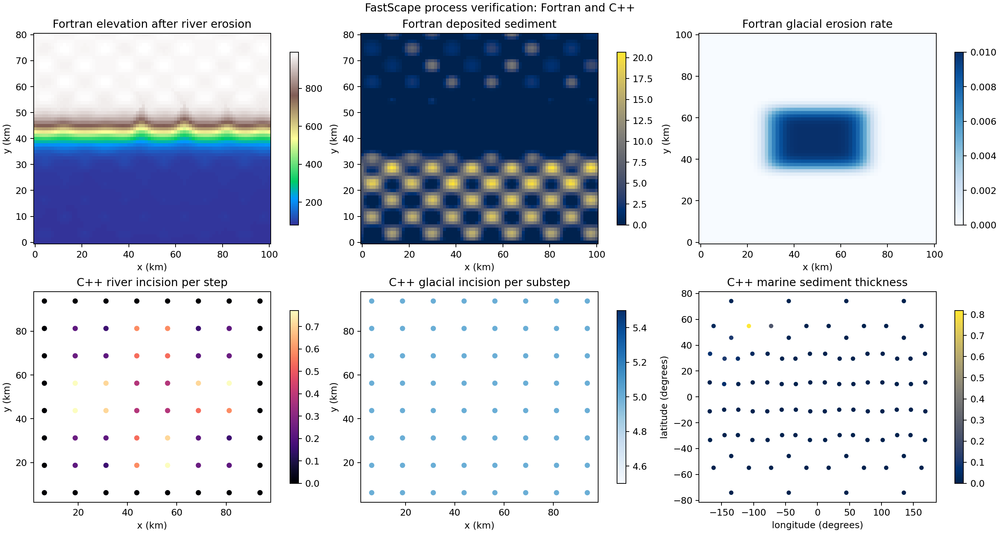
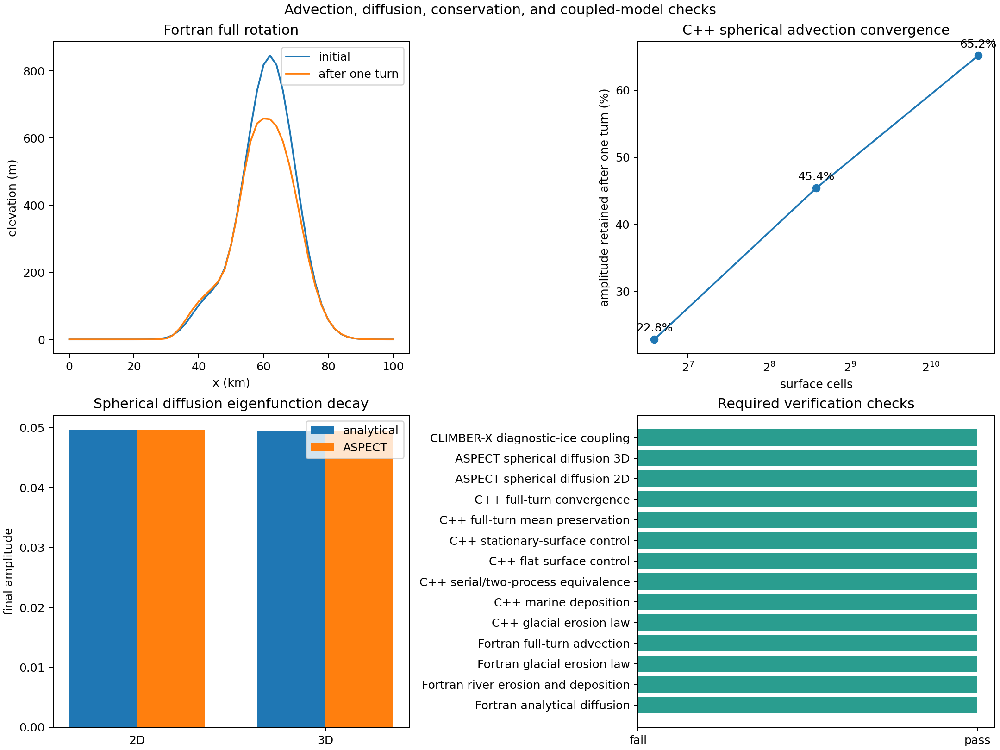

# FastScape and CLIMBER-X verification

This directory provides a reproducible, bounded-memory verification of the
Fortran FastScape library, the C++ FastScape coupling in ASPECT, spherical
surface diffusion, tangential surface advection, and the lightweight CLIMBER-X
climate-to-ice loop.

For a complete explanation written for a reader without modeling experience,
including equations, figures, pass conditions, limitations, and a glossary, see
[`VERIFICATION_REPORT.md`](VERIFICATION_REPORT.md).

The tests intentionally separate three questions:

1. Does each numerical operation reproduce an analytical result or conserve
   the correct quantity?
2. Do the Fortran and C++ implementations show the same physical behavior when
   their equations are comparable?
3. Does the complete climate, ice, surface-process, and solid-Earth exchange
   complete more than one coupling window with finite fields?

## Current local result

All 14 required checks pass. Detailed machine-readable values are in
`results/verification-metrics.json`.

| Check | Result |
|---|---:|
| Fortran planar diffusion amplitude error | 0.0038% |
| Fortran river erosion | maximum 0.00557 m/yr |
| Fortran deposited sediment | maximum 20.67 m |
| Fortran glacial erosion law | 0.0100 m/yr expected and measured |
| Fortran full-turn field correlation | 0.9867 |
| Fortran full-turn integral error | 0.0021% |
| C++ glacial erosion | 5.0 m expected and measured per 500-year substep |
| C++ marine sediment thickness | maximum 0.819 m |
| C++ serial versus two-process difference | 0 |
| Two-dimensional spherical diffusion error | 0.0024% |
| Three-dimensional spherical diffusion error | 0.0797% |
| CLIMBER-X coupling windows | 2 |
| CLIMBER-X climate years / surface years | 3 / 40 |

The complete C++ library test set also passed: 153 tests. ASPECT's unit-test
binary passed 55 test cases and 2,657 assertions. The Fortran glacial
regression, both spherical-diffusion regression cases, and all eight climate
exchange-format tests passed.





The existing CLIMBER-X field figures remain in
`../fastscape_climberx_physical_loop/output-diagnostic-ice-sequence/`:
`physical-loop-summary.png`, `diagnostic-vs-yelmo.png`, and
`runtime-comparison.png`.

## What is compared directly

The Fortran and C++ glacial laws are not identical. The Fortran implementation
uses a thickness-saturation factor, while the C++ implementation uses a minimum
ice-thickness threshold. The benchmark therefore uses thick ice, where the
Fortran saturation factor is effectively one, and checks both implementations
against the common limit: erosion coefficient multiplied by basal sliding
speed. Both reproduce that limit exactly.

River erosion and deposition are compared as process and conservation tests,
not as a point-for-point equality. The two implementations use different grids,
flow routing, and sediment-transport rules. Both must produce finite drainage,
positive incision, and positive deposited thickness. The C++ marine case also
checks its stored solid-sediment volume.

The Fortran diffusion benchmark has an exact sinusoidal solution. The separate
ASPECT spherical-diffusion benchmarks use known surface-Laplacian eigenfunctions
on a circle and a sphere. This is stronger evidence than comparing two numerical
codes that could share the same error.

## Advection and drainage interpretation

`fortran_reference_benchmarks.f90` rotates an asymmetric landscape through one
complete turn with erosion and physical diffusion disabled. Its higher-order
finite-volume method conserves the landscape integral to 0.0021%, retains 74.5%
of the peak, and returns a field correlation of 0.9867. Drainage is recomputed
from the transported relief after every step, so it follows the moving valleys
rather than being diffused as an independent drainage field.

The C++ spherical test revealed two issues during this work:

- Bedrock elevation had been transported as a conserved mass density. It is now
  transported as a tracer, while sediment thickness remains a conserved volume.
  A constant elevation is therefore preserved even when the discrete velocity
  has small face divergence.
- A rigid-rotation benchmark needs to exclude normal uplift so it tests only
  tangential transport. The new `Apply normal material velocity` option defaults
  to `true` for physical models and is disabled only in these isolation tests.

The C++ scheme is first-order and therefore numerically diffusive. After one
turn it retains 22.8%, 45.4%, and 65.2% of the analytical amplitude on spheres
with 96, 384, and 1,536 surface cells. The mean elevation stays within 0.05 m of
zero and field correlation improves from 0.868 to 0.951. This is convergence,
but it also shows that coarse global runs should not be used when preservation
of narrow valleys is important. A higher-order monotonic transport method is a
clear future improvement.

## CLIMBER-X result

The reused completed diagnostic-ice run exercised two feedback windows:

`CLIMBER-X climate -> precipitation and diagnostic ice -> FastScape erosion and
sediment flux -> ASPECT surface and true polar wander -> returned topography ->
CLIMBER-X`

It completed three climate years and 40 ASPECT/FastScape years. On this laptop,
the climate calculation took 309.7 seconds, the two coupled ASPECT windows took
9.1 seconds, and binary field exchange took less than 0.13 seconds per transfer.
The full loop was about 105 times slower than the tiny uncoupled ASPECT control;
within the solid-Earth part alone, coupling made ASPECT about three times slower.

The climate exchange is binary and direct; NetCDF files remain CLIMBER-X's own
diagnostic output rather than the coupling transport.

## Reproduce

From this directory, using the current local installation:

```bash
/Users/ponsm/anaconda3/bin/python run_verification.py
```

This runs one model at a time, limits compilation and test concurrency to two
jobs, and terminates a child process if free memory falls below 15%. It does not
push or otherwise contact a remote repository.

The several-minute climate calculation is not repeated by default because the
existing completed result is analyzed. To repeat it as well:

```bash
/Users/ponsm/anaconda3/bin/python run_verification.py --run-climate
```

To regenerate only the metrics and figures from existing results:

```bash
/Users/ponsm/anaconda3/bin/python run_verification.py --analysis-only
```

Raw run products are kept under `output/` and ignored by Git. Compact metrics
and figures under `results/` are versioned.
