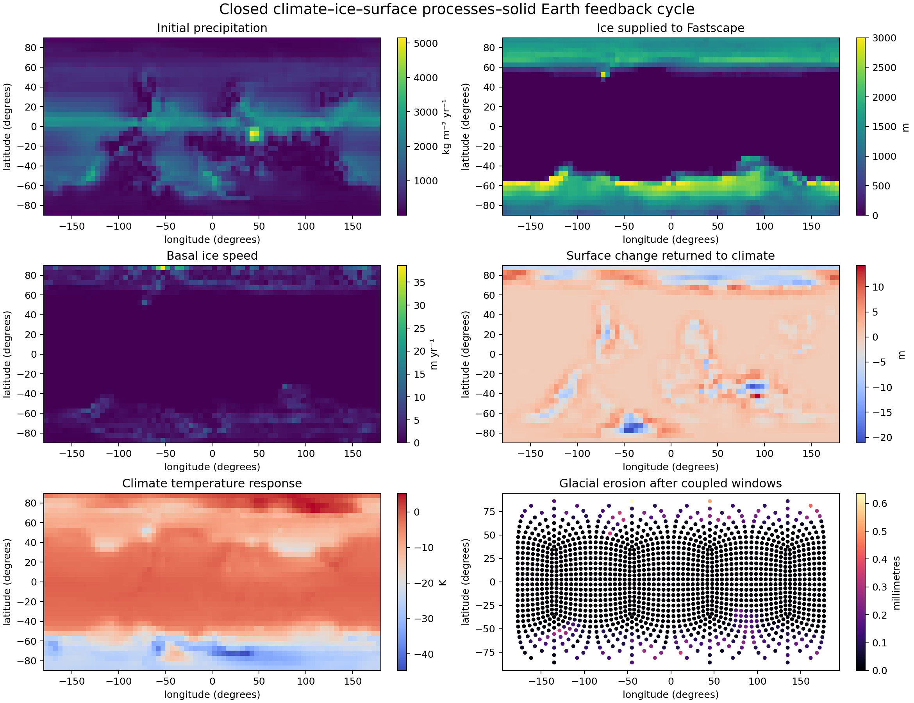
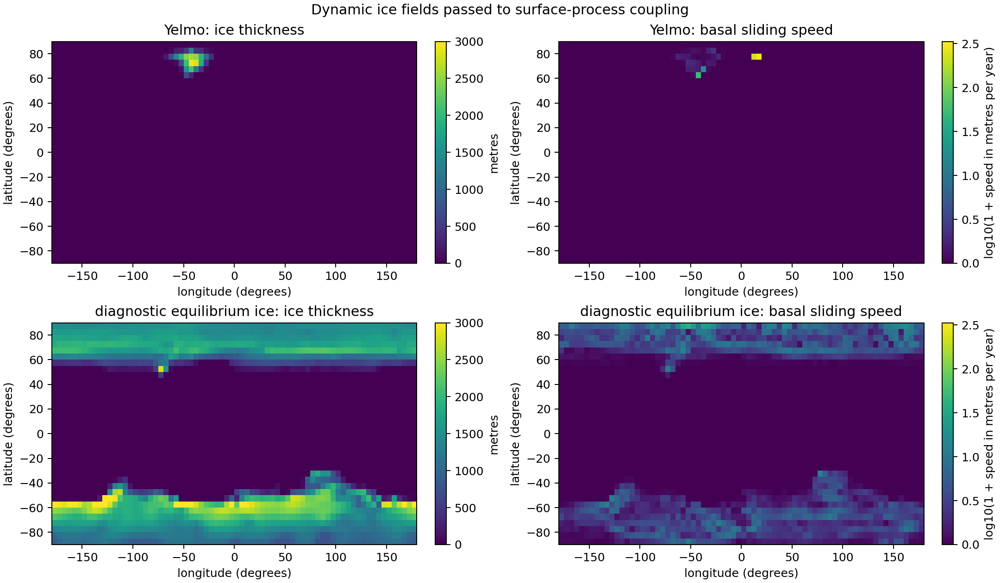
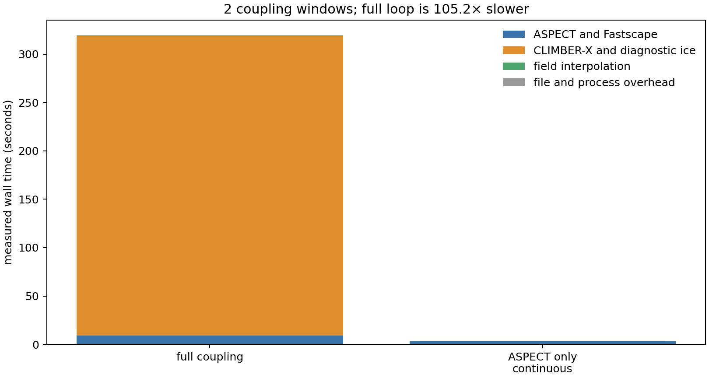

# Verification report for ASPECT, FastScape, and CLIMBER-X

## Plain-language summary

This report asks whether the coupled model is doing what its equations say it
should do.

The model has three main parts:

- **ASPECT** calculates the slowly deforming solid Earth: mantle flow,
  tectonics, uplift, subsidence, and deformation of the surface mesh.
- **FastScape** calculates changes to the landscape: river incision, sediment
  transport and deposition, glacial erosion, hillslope smoothing, drainage, and
  horizontal transport of surface information.
- **CLIMBER-X** calculates climate fields. In the inexpensive configuration
  tested here, temperature and precipitation are converted into an approximate
  ice distribution without running a costly dynamic ice-sheet model.

The intended feedback is:

```text
climate and ice
      ↓
rainfall, river flow, and glacial erosion
      ↓
erosion, sediment transport, and deposition
      ↓
surface loading, topography, and solid-Earth deformation
      ↓
new topography and geographic position returned to the climate model
```

Fourteen required checks pass. This does not prove that every future global
simulation will be physically correct. It does show that the individual
operations reproduce analytical solutions, conserve the intended quantities,
give the same serial and parallel answers, and complete a short coupled climate
feedback loop without invalid values.

## How to read the results

A **test** checks a small piece of software, often with a simple yes-or-no
condition. A **benchmark** compares a numerical result with a known answer or
with a controlled reference calculation. A **smoke test** only establishes that
a model starts, advances, and finishes; it is weaker than an analytical
benchmark.

The strongest evidence in this report comes from analytical benchmarks because
the correct answer is known independently of either code. Cross-code
comparisons are used where the Fortran and C++ implementations solve comparable
but not identical equations.

## Overall result

| Verification | Required behavior | Measured result | Status |
|---|---|---:|:---:|
| Fortran planar diffusion | Match exact amplitude within 1% | 0.0038% error | Pass |
| Fortran river erosion and deposition | Positive erosion, drainage, and deposition | 0.00557 m/yr erosion; 20.67 m sediment | Pass |
| Fortran glacial erosion law | Match thick-ice analytical rate | 0.0100 m/yr | Pass |
| Fortran full rotation | Correlation above 0.98; integral error below 0.1% | 0.9867; 0.0021% | Pass |
| C++ glacial erosion law | Match analytical incision | 5.0 m per substep | Pass |
| C++ marine deposition | Positive thickness and stored volume | 0.819 m; 4.777×10¹² m³ | Pass |
| C++ serial/parallel comparison | Relative difference below 10⁻¹² | 0 | Pass |
| C++ flat-surface control | No erosion or sediment export | Both zero | Pass |
| C++ stationary-surface control | No change without transport or uplift | 0 m change | Pass |
| C++ full-turn mean preservation | Mean drift below 0.1 m | At most 0.043 m | Pass |
| C++ advection refinement | Finer grids retain more structure | 22.8% → 45.4% → 65.2% | Pass |
| Circular surface diffusion | Match exact harmonic decay within 0.2% | 0.0024% error | Pass |
| Spherical surface diffusion | Match exact harmonic decay within 0.2% | 0.0797% error | Pass |
| CLIMBER-X feedback loop | At least two complete exchanges | Two windows completed | Pass |


The top row shows the Fortran reference cases. The bottom row shows the C++
surface-process fields produced through ASPECT. Bright colors indicate larger
values; each panel has its own scale and units.


The upper-left panel shows the smoothing caused by one complete Fortran
rotation. The upper-right panel shows that the C++ spherical advection improves
as the landscape grid is refined. The lower-left panel compares measured and
analytical spherical-diffusion amplitudes. The lower-right panel records the
fourteen required checks.

## 1. Hillslope diffusion on a flat square

### What diffusion represents

Soil creep, small landslides, and other local processes tend to move material
from steep or high places toward low places. A simple model treats this as
linear diffusion:

$$
\frac{\partial h}{\partial t}=\kappa\nabla^2 h.
$$

Here:

- $h$ is surface elevation in metres;
- $t$ is time in years;
- $\kappa$ is hillslope diffusivity in square metres per year;
- $\nabla^2h$ measures how curved the landscape is.

The benchmark begins with a smooth hill in a 100 km by 100 km square:

$$
h(x,y,0)=A_0\sin\left(\frac{\pi x}{L}\right)
              \sin\left(\frac{\pi y}{L}\right),
$$

where $A_0=1000$ m and $L=100{,}000$ m. Because this particular hill is an
eigenfunction of the diffusion equation, its shape should stay the same while
its amplitude decreases exactly as

$$
A(t)=A_0\exp\left(-\frac{2\pi^2\kappa t}{L^2}\right).
$$

With $\kappa=100$ m²/yr and $t=1{,}000{,}000$ yr, the exact amplitude is
820.8687 m. Fortran FastScape gives 820.8999 m, a relative error of
0.0038%. This passes the 1% limit by a large margin.

### What this demonstrates

The result verifies the magnitude and sign of diffusion, its time scaling, and
the fixed-boundary treatment. It does not test river routing or deposition;
those are isolated in later benchmarks.

## 2. River incision and sediment deposition

### River erosion equation

FastScape represents river incision with a stream-power equation of the form

$$
E=K A^m S^n.
$$

Here:

- $E$ is the lowering rate of the river bed;
- $K$ is an erosion-efficiency coefficient;
- $A$ is upstream drainage area, used as a proxy for water discharge;
- $S$ is local downhill slope;
- $m$ and $n$ control the sensitivity to drainage area and slope.

The benchmark starts with an elevated plateau, small deterministic roughness,
and one open boundary. Water is routed downhill. Incision generates sediment,
and the transport calculation allows part of that sediment to be deposited in
lower areas.

### Result

The Fortran model produces:

- maximum erosion rate: 0.00557 m/yr;
- maximum drainage area: 9.700×10⁸ m²;
- maximum deposited-sediment thickness: 20.67 m.

The test requires all fields to remain finite, drainage area to be positive,
erosion to occur in the source region, and deposition to occur downstream. All
conditions pass.

### Why Fortran and C++ are not compared point by point

The two implementations do not use identical meshes, drainage algorithms, or
sediment-transport equations. A point-by-point difference would mix numerical
resolution with physical differences. The meaningful comparison is that both
codes route drainage, erode elevated regions, generate sediment flux, and
deposit sediment while satisfying their own conservation checks.

## 3. Glacial erosion

### Fortran formulation

The Fortran implementation uses

$$
E_g=K_g u_b^l\left(1-\exp\left[-\frac{H}{H_*}\right]\right).
$$

Here:

- $E_g$ is glacial erosion rate;
- $K_g$ is glacial erodibility;
- $u_b$ is basal sliding speed;
- $l$ is the sliding-speed exponent;
- $H$ is ice thickness;
- $H_*$ controls how quickly erosion saturates as ice becomes thicker.

Thin ice produces little erosion. When $H$ is much larger than $H_*$, the
parenthesis approaches one and the equation becomes $E_g\approx K_g u_b^l$.

### C++ formulation

The current C++ implementation uses a simpler threshold:

$$
E_g=
\begin{cases}
K_g u_b^l, & H\ge H_{\min},\\
0, & H<H_{\min}.
\end{cases}
$$

$H_{\min}$ is the minimum ice thickness required for erosion.

### Fair comparison and result

The benchmark uses thick ice, so the Fortran saturation factor is essentially
one and both laws have the same expected limit. With $K_g=10^{-4}$,
$u_b=100$ m/yr, and $l=1$:

$$
E_g=10^{-4}\times100=0.01\ \text{m/yr}.
$$

Fortran measures exactly 0.01 m/yr. The C++ calculation uses a 500-year
landscape substep and therefore expects $0.01\times500=5$ m of incision; it
measures exactly 5 m.

This confirms the implemented erosion laws. It does not establish that the
chosen coefficient is the best value for real glaciers; field calibration is a
separate scientific task.

## 4. Marine sediment deposition and conservation

River erosion creates a solid sediment volume. For a cell of area $A_i$ lowered
by $\Delta h_i$, that volume is approximately

$$
\Delta V_{s,i}=A_i\Delta h_i.
$$

When sediment with porosity $\phi$ is deposited in an ocean cell of area $A_j$,
solid volume is converted into bulk sediment thickness:

$$
\Delta H_j=\frac{\Delta V_s}{(1-\phi)A_j}.
$$

Porosity is the fraction occupied by pore space and water. Dividing by
$1-\phi$ makes the deposited bulk layer thicker than the equivalent solid
material.

The global C++ test connects river outlets to the largest connected ocean,
deposits sediment at the coast, and diffuses that mobile sediment over the sea
floor. It produces a maximum thickness of 0.819 m and stores
4.777×10¹² m³ of solid sediment. Thickness never becomes negative.

The separate flat-surface control has no relief, no drainage-driven incision,
and therefore exactly zero erosion and zero sediment export. This prevents a
test from passing merely because it always generates positive numbers.

## 5. Horizontal advection of landscapes

### What advection means

Advection moves information with a horizontal velocity. Elevation behaves like
a tracer:

$$
\frac{\partial h}{\partial t}+\mathbf{u}\cdot\nabla h=0,
$$

where $\mathbf{u}$ is tangential surface velocity. A uniform elevation must
remain uniform during this motion.

Sediment thickness is different because it represents a volume per unit area.
It is transported conservatively:

$$
\frac{\partial s}{\partial t}+\nabla\cdot(\mathbf{u}s)=0.
$$

Treating elevation as if it were sediment volume caused an artificial drift on
the spherical grid. The C++ implementation now transports bedrock elevation as
a tracer and sediment thickness as a conserved field.

### Time-step safety

An explicit transport method must not move information through too many cells
in one step. This is measured with the Courant number:

$$
C=\frac{|\mathbf{u}|\Delta t}{\Delta x}.
$$

$\Delta t$ is the time step and $\Delta x$ is a representative cell size. The
code subdivides a surface-process step until the specified maximum Courant
number is respected.

### Fortran full-turn test

An asymmetric two-peak landscape is rotated by 360 degrees. River erosion,
glacial erosion, uplift, and physical diffusion are disabled. After a perfect
rotation, the final field would equal the initial field.

The higher-order Fortran method gives:

- correlation with the initial field: 0.9867;
- relative landscape-integral error: 0.0021%;
- relative root-mean-square error: 0.1697;
- peak amplitude retained: 74.5%.

The integral is very well conserved. The lower peak shows that numerical
smoothing still occurs.

### C++ spherical full-turn test

The C++ test rotates a known global relief field through 360 degrees. Normal
uplift is disabled only for this benchmark so that it isolates tangential
transport. The ordinary physical default still applies ASPECT's normal material
velocity.

| Surface cells | Field correlation | Amplitude retained | Mean elevation |
|---:|---:|---:|---:|
| 96 | 0.8676 | 22.8% | 0.043 m |
| 384 | 0.9235 | 45.4% | 0.027 m |
| 1,536 | 0.9505 | 65.2% | 0.012 m |

The preserved near-zero mean and improving correlation show that the corrected
scheme works and converges. The amplitude values also show an important
limitation: the first-order method strongly smooths narrow topographic features
on coarse grids.

Drainage area is not itself smeared as a transported image. After elevation is
moved, the flow directions and drainage areas are recalculated from the new
landscape. Rivers therefore follow the transported valleys. If the valleys are
numerically smoothed, however, their drainage networks will also become less
distinct. This is why landscape resolution and a future higher-order monotonic
transport scheme matter.

## 6. Diffusion on a circle and a sphere

Flat-grid diffusion is not enough for a global model. On a curved surface, the
ordinary flat Laplacian is replaced by the surface Laplacian, also called the
Laplace–Beltrami operator.

### Circular benchmark

For a circular surface of radius $R$, the mode $\cos(m\phi)$ decays as

$$
A(t)=A_0\exp\left(-\frac{\kappa m^2t}{R^2}\right).
$$

The test uses $m=2$, $R=1$, $A_0=0.05$, $\kappa=0.1$, and $t=0.02$. The exact
final amplitude is 0.04960160. ASPECT gives 0.04960281, an error of 0.0024%.

### Spherical benchmark

Spherical harmonics have eigenvalue $l(l+1)/R^2$. Their amplitude decays as

$$
A(t)=A_0\exp\left(-\frac{\kappa l(l+1)t}{R^2}\right).
$$

The test uses the degree-two pattern

$$
P_2(\cos\theta)=\frac{1}{2}(3\cos^2\theta-1).
$$

The exact final amplitude is 0.04940359. ASPECT gives 0.04944296, an error of
0.0797%. Both curved-surface benchmarks pass the 0.2% limit.

## 7. Serial and parallel consistency

A distributed calculation divides the ASPECT mesh among multiple processes.
The same surface information must be transferred to and from rank zero without
changing the answer.

The 100 km box and global spherical tests were run both serially and with two
Message Passing Interface processes. The following final quantities were
compared:

- eroded volume;
- sediment export rate;
- maximum drainage area;
- minimum elevation;
- maximum elevation.

The maximum relative difference is exactly zero at the printed precision. This
verifies the current gather, redistribution, and surface-update path for these
cases.

## 8. CLIMBER-X climate and diagnostic ice

### Why diagnostic ice is used here

Yelmo and SICOPOLIS are dynamic ice-sheet models. They calculate ice flow and
are scientifically valuable, but they are expensive for quick coupling tests.
The diagnostic option estimates ice thickness and basal sliding fields from
the climate state. It is not a replacement for a dynamic ice sheet; it is a
fast way to test the complete feedback and drive glacial erosion.

### Tested exchange sequence

The completed run performs:

```text
CLIMBER-X temperature and precipitation
    → diagnostic ice thickness and basal sliding
    → FastScape river and glacial erosion
    → sediment flux and ASPECT surface change
    → true-polar-wander state and returned topography
    → next CLIMBER-X climate window
```

It completed two coupling windows, three climate years, and 40
ASPECT/FastScape years. The final exchanged surface exists and contains finite
fields.



This figure shows the fields passed through the physical loop and their surface
response.



This comparison explains what is gained and lost by using the inexpensive
diagnostic ice distribution instead of Yelmo.



On this laptop:

- climate calculation: 309.7 s;
- two coupled ASPECT windows: 9.1 s;
- each binary field exchange: less than 0.13 s;
- complete coupled loop: 319.3 s;
- small uncoupled ASPECT control: 3.0 s.

The climate calculation, not field transfer, dominates the runtime. The full
loop is about 105 times slower than the deliberately tiny uncoupled ASPECT
control. Comparing only the ASPECT portion, the coupled run is about three times
slower.

The coupling fields are transferred in a compact binary exchange format.
CLIMBER-X still writes NetCDF diagnostic files, but those files are not needed
as the coupling transport.

## 9. Software regression suites

The physical benchmarks are accompanied by lower-level regression tests:

| Suite | Coverage | Result |
|---|---|---:|
| FastScape C++ library | grids, routing, sinks, erosion, diffusion, conservation, and utilities | 153/153 passed |
| ASPECT unit tests | core and plugin-level assertions | 55/55 cases; 2,657/2,657 assertions |
| Fortran glacial regression | analytical glacial erosion | 1/1 passed |
| Climate exchange tests | binary read/write, fields, metadata, and round trips | 8/8 passed |
| Spherical diffusion regressions | circular and spherical harmonics | 2/2 passed |
| ASPECT/FastScape serial integrations | box, glacial, global, sensitivity, flat control, solver, marine, advection, climate ice | 9/9 completed |
| Parallel integrations | box and global with two processes | 2/2 completed |
| Full spherical rotations | 96, 384, and 1,536 landscape cells | 3/3 completed |

The global sensitivity case produces substantially more incision when the
erosion coefficient is increased. The zero-relief case produces none. The
alternative geometric multigrid solver produces the same erosion result as the
baseline solver. These paired controls help detect accidentally inactive
physics and solver-dependent behavior.

## 10. Quantities used to judge agreement

### Relative error

For a measured value $x$ and known value $x_*$:

$$
\epsilon_{rel}=\frac{|x-x_*|}{|x_*|}.
$$

Smaller is better. An error of 0.001 is 0.1%.

### Correlation

Correlation measures whether high and low regions occur in the same places. A
value of one means identical spatial pattern after allowing for amplitude; zero
means no linear spatial relationship. Correlation alone cannot detect a field
that has the correct pattern but has been smoothed nearly flat, so amplitude is
reported separately.

### Relative root-mean-square error

For numerical values $h_i$ and references $h_i^*$:

$$
\epsilon_{RMS}=
\frac{\sqrt{\frac{1}{N}\sum_i(h_i-h_i^*)^2}}
     {\sqrt{\frac{1}{N}\sum_i(h_i^*)^2}}.
$$

This metric responds to both location and amplitude errors.

### Integral conservation error

For a regular grid, the benchmark compares the sum of elevation before and
after transport:

$$
\epsilon_V=\left|\frac{\sum_i h_i^{final}}
                         {\sum_i h_i^{initial}}-1\right|.
$$

For unequal cells, the physically correct version weights each value by its
cell area. Sediment tests use area-weighted volume internally.

## 11. Problems found by the benchmarks

The exercise found issues that ordinary short smoke tests had hidden:

1. The nominal zero-topography control inherited 1,500 m of synthetic relief
   from its base parameter file. The self-contained control now explicitly sets
   both ASPECT and FastScape relief to zero.
2. Reusing an output directory appended a new sediment budget to the previous
   history while replacing the numbered surface files. Fresh model histories
   now replace the old budget; a genuine checkpoint restart still appends.
3. C++ bedrock elevation was transported as a conserved density instead of a
   tracer. This allowed discrete spherical velocity divergence to create
   artificial elevation drift. Elevation and sediment now use their appropriate
   equations.
4. The first Fortran rotation driver requested a larger time step than the
   advection routine allowed internally. The routine shortened the step, but
   the driver originally counted it as a full requested step. The benchmark now
   chooses a time step below the internal Courant limit.

Finding these problems is evidence that the benchmarks are sensitive, rather
than merely checking that executables return zero.

## 12. What remains uncertain

The following questions are not resolved by these tests:

- **Natural-parameter calibration.** Passing a numerical benchmark does not
  prove that erosion coefficients, sediment porosity, or glacial erodibility
  match a particular region or geological period.
- **Coarse-grid valley preservation.** The first-order C++ advection is stable
  and convergent but overly diffusive at low spherical resolution.
- **Long climate equilibration.** Three climate years test exchange and
  feedback, not equilibrium climate statistics.
- **Dynamic ice sheets.** The fast loop uses diagnostic ice. Yelmo and SICOPOLIS
  remain optional higher-cost tests.
- **Long-term coupled stability.** Two feedback windows demonstrate operation,
  not million-year stability.
- **Exact Fortran/C++ equality.** Several physical laws and discretizations
  differ. Analytical and conservation checks are more defensible than forcing
  unequal codes to match point by point.

The most important next numerical improvement is a higher-order monotonic C++
surface-advection method, followed by a resolution study using realistic river
networks. The most important scientific next step is calibration against
observed sediment fluxes, topography, ice extent, and basin stratigraphy.

## 13. Reproducing the report

From `cookbooks/fastscape_verification`:

```bash
/Users/ponsm/anaconda3/bin/python run_verification.py
```

The runner starts one model at a time, uses at most two build or test jobs, and
terminates a child if free memory falls below 15%. It performs no network push.

To repeat the two-process tests where local socket creation is allowed:

```bash
/Users/ponsm/anaconda3/bin/python run_verification.py --run-two-process
```

To repeat the several-minute climate sequence:

```bash
/Users/ponsm/anaconda3/bin/python run_verification.py --run-climate
```

To regenerate this report's numerical figures from existing raw outputs:

```bash
/Users/ponsm/anaconda3/bin/python run_verification.py --analysis-only
```

The exact numerical values used here are stored in
`results/verification-metrics.json`. Raw outputs and per-command logs are kept
under `output/` and are intentionally not committed because they can be
regenerated.

## Glossary

| Term | Meaning |
|---|---|
| Advection | Horizontal movement of a field by a velocity |
| Analytical solution | A result obtained directly from an equation rather than a numerical approximation |
| Basal sliding | Motion of ice relative to the bed beneath it |
| Cell | One small area or volume used by a numerical mesh |
| Correlation | Measure of similarity in spatial pattern |
| Courant number | Distance moved during one step divided by cell size |
| Deposition | Addition of transported sediment to the surface or sea floor |
| Diagnostic ice | Inexpensive estimated ice distribution without solving dynamic ice flow |
| Diffusion | Smoothing caused by transport from high or steep regions toward low regions |
| Drainage area | Total upstream area supplying water to a point |
| Erosion | Removal or lowering of surface material |
| Finite-volume method | Numerical method based on fluxes across cell boundaries |
| Message Passing Interface | Standard used by multiple processes to exchange numerical data |
| NetCDF | Common scientific-data file format used for model diagnostics |
| Porosity | Fraction of sediment volume occupied by pore space |
| Regression test | Test that detects a change from previously verified behavior |
| Sediment flux | Volume of solid sediment crossing a location per unit time |
| Spherical harmonic | Smooth wave-like pattern defined on a sphere |
| Stream power | River-incision rule based on drainage area and slope |
| Surface tracer | Quantity attached to and moved with the surface without being treated as mass |
| True polar wander | Reorientation of a rotating planet relative to its solid surface |
